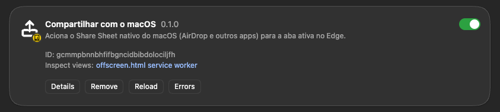
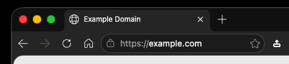
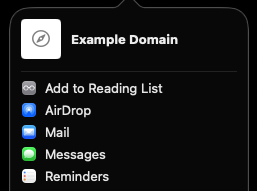

# Compartilhar com o macOS

O botao de share que o Edge tirou do Mac, de volta.

No macOS, o Edge parou de mostrar o botao de compartilhamento nativo (o que abre AirDrop, Mensagens, Lembretes e o resto). Esta extensao devolve isso: um icone na toolbar que abre o Share Sheet do sistema para a aba que voce esta vendo.

## O que ela faz

Clique no icone. O Share Sheet do macOS abre com o titulo e a URL da aba atual. Sem popup, sem tela extra no meio do caminho.

O icone tambem acompanha o tema do Edge: branco quando a toolbar esta escura, cinza quando esta clara, e troca sozinho se voce mudar o tema com o navegador aberto.

Em paginas onde o navegador bloqueia scripts (`chrome://`, `edge://`, lojas de extensao), uma notificacao avisa que ali nao rola. Erros tecnicos tambem avisam; cancelar o Share Sheet e silencioso, sem popup de erro.

## Demonstracao

Extensao instalada no Edge, icone visivel na toolbar (branco, tema escuro) e o Share Sheet nativo abrindo com AirDrop, Mail, Messages e Reminders:

<p>
  <br>
  <br>
  
</p>

## Instalar

Sem loja por enquanto, entao a instalacao e direto do codigo:

```bash
npm install
npm run build
```

No Edge: `edge://extensions` -> Modo de desenvolvedor -> Carregar sem pacote -> selecione esta pasta.

## Desenvolvimento

```bash
npm test          # suite de testes (Vitest)
npm run typecheck # checagem de tipos
npm run build     # gera dist/background.js e dist/offscreen.js
npm run package   # build + .zip pronto para submissao a lojas
```

O icone e desenhado por codigo, sem nenhuma ferramenta de design externa. Rode `npm run generate-icons` para regerar `icons/white/` e `icons/dark/` se o desenho mudar.

## Stack

TypeScript puro, sem framework de UI (a extensao nao tem popup visivel). Vitest para os testes, esbuild para o bundle.

## Como este repositorio e mantido

Cada funcionalidade nasce de um spec aprovado em `.docs/specs/`, com testes escritos antes do codigo e revisao independente antes do merge. O fluxo completo esta em `.rules/global.md`.

## Licenca

MIT - veja [LICENSE](LICENSE).


## Permissões, mensagens e assinatura

O manifest usa somente `activeTab`, `scripting`, `notifications` e `offscreen`, cada uma vinculada a uma necessidade documentada. O contrato de mensagens entre o service worker e o documento offscreen aceita `theme-detected` com `isDark` booleano; mensagens desconhecidas são ignoradas.

Para validar uma instalação limpa: crie um perfil Edge novo, execute `npm ci && npm test && npm run build`, carregue a pasta em `edge://extensions` como extensão sem pacote e teste uma página HTTPS, uma página restrita, o cancelamento do Share Sheet, as notificações e a troca de tema. Para distribuição, use `npm run package`, siga o processo de assinatura da loja e mantenha chaves privadas fora do repositório. Detalhes em [`docs/SECURITY-AND-SIGNING.md`](docs/SECURITY-AND-SIGNING.md).
